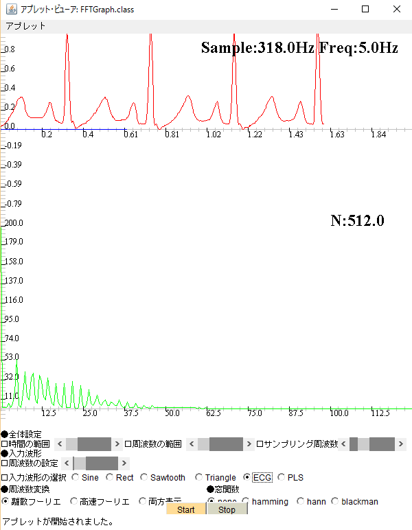

# Java Sample Program for Medical System

## 1. Notice

This software is experimental and a work in progress.
Use of these files is at your own risk.

## 2. Summary
This repo is collection of java sample programs for medical, electro-maginetic, fluid-science and ultrasonic.

## 3. Software collection
### 3.1 FFTGraph
This sample is ECG/PLS Viewer written in Java AWT.<br>
This sample have also DFT and FFT function.<br>

* Fourier transform

$$ G(f) = \int_{-\infty}^{\infty} f(t)e^{-i 2\pi f t}dt $$
$$ f(t) = \int_{-\infty}^{\infty} G(f) e^{i 2\pi f t}df $$

* DFT (Discrete Fourier Transform)

$$ G(\Delta{f} \cdot n) = \sum_{k=0}^{N-1} \Delta{t}\cdot f(\Delta{t}\cdot k)e^{-i 2\pi (\frac{n}{N}) \cdot k} $$

$$ f(\Delta{t} \cdot k) = \sum_{n=0}^{N-1} G(\frac{1}{\Delta{t} N}\cdot n) e^{i 2\pi (\frac{n}{N})\cdot k}$$

> N : Total number <br>
> $\Delta{t}$ : Sampling period <br>
> $\Delta{f}=\frac{1}{\Delta{t} N}$ : Basic frequency <br>
> k    :    Which number (time region)？ <br>
> n : How many times of basic frequency? <br>

* FFT (Fast Fourier Transform)
$$ W = e^{-i2\pi/N} $$
$$ G(\frac{n}{N}) = \sum_{k=0}^{N-1} f(k)W^{nk} $$

#### compaile

```
javac ./src/*.java -encoding UTF8 -Xlint:deprecation -d ./bin/
```

#### Run
```
appletviewer ./bin/DFTFFTGraph.html
```
#### Overview


### 3.2 CircleGraph

### 3.3 SineCosinGraph

### 3.4 1D-FDTD Program

### 3.5 Ray-tracing Program
